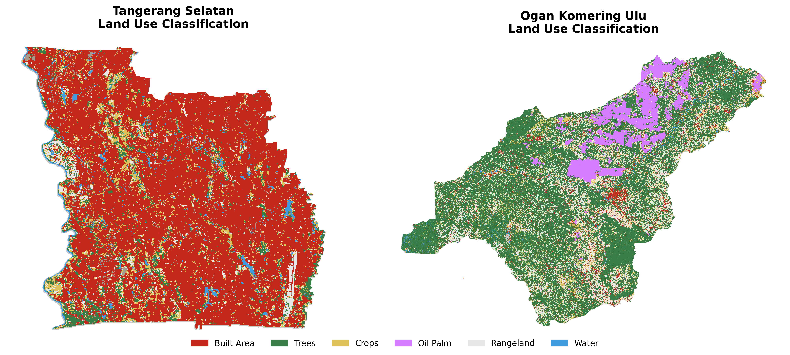

# Geosquare.ai Hiring Challenge Submission
## "Invisible Market" Challenge - Spatial Data Scientist Position

**Candidate**: Ahmad Rayis
**Submission Date**: January 23, 2026
**Contact**: ahmadrayz007@gmail.com
**Challenge**: Grid-Based Investment Analysis - Tangerang Selatan vs Ogan Komering Ulu

---

## 🎯 Executive Summary

This submission presents a comparative spatial intelligence analysis of **Tangerang Selatan** (urban) vs **Ogan Komering Ulu** (rural) to guide investor decision-making using multi-source geospatial data integrated into a 50m × 50m grid system.

**Key Question (from Challenge Brief)**:
*"Does the Official Zoning map say 'Forest,' but the Satellite says 'Dense Housing'?"*

**Answer**: **YES.**
- **Tangsel**: 33% of protected zones show actual built development (RTRW violations → regulatory risk)
- **OKU**: 3.4% of residential zones remain undeveloped (RTRW opportunities → land banking zones)

**Investment Thesis**: OKU is the **Hidden Gem** with 22.6x more land, 98% undeveloped, 18% safer, and massive first-mover advantage in an underserved emerging market.

---

## 📄 Main Deliverable

### Investment Memo (2-Page PDF)
**Location**: [`phase5_investment_memo/latex/oku_investment_memo.pdf`](phase5_investment_memo/latex/oku_investment_memo.pdf)

**Contents** (as required by challenge):
- ✅ Visual analysis comparing both regions
- ✅ "Hidden Potential" of OKU identified through data
- ✅ Risk analysis (e.g., "High flood risk in high-growth zones")
- ✅ Investment use cases (Retail, Property, Agriculture, Industrial)
- ✅ RTRW validation findings (violations vs opportunities)
- ✅ Portfolio diversification strategy
- ✅ Action items for investor

**Format**: 2 pages (max requirement met), 12pt font, 2-column layout
**Tool**: LaTeX (professional typesetting)



---

## 🗂️ Project Structure (Phase-Based Workflow)

This project follows the 4-phase structure outlined in the hiring challenge:

```
Geosquare Data Science Challenge/
│
├── 📂 phase1_data_hunt/              ← Challenge Phase 1: Hunt
│   ├── population/                   Disdukcapil data (Tableau scraper, AI vision OCR)
│   ├── rtrw/                         Official zoning maps (BIG SatuPeta API)
│   ├── boundaries/                   Admin boundaries (BIG RBI10K)
│   ├── osm/                          Roads & POI (OpenStreetMap PBF extraction)
│   └── bnpb/                         Disaster hazard data (BNPB InaRISK)
│
├── 📂 phase2_satellite/              ← Challenge Phase 2: Remote Sensing
│   ├── scripts/                      Google Earth Engine export scripts
│   ├── data/lulc/                    ESA WorldCover 10m LULC (Random Forest)
│   ├── data/nightlights/             VIIRS 2020-2025 (economic activity proxy)
│   └── rtrw_validation/              ⭐ RTRW vs Satellite validation notebook
│
├── 📂 phase3_dasymetric/             ← Challenge Phase 3: Algorithm (Literature & Method)
│   ├── dasymetric_mapping.ipynb      Population disaggregation (Stevens et al. 2015)
│   └── outputs/                      Population grids (50m × 50m)
│
├── 📂 phase4_grid_integration/       ← Challenge Phase 4: Geosquare Grid
│   ├── grid_data_integration.ipynb   All layers → geosquare grid (Level 12)
│   └── outputs/
│       ├── grid_tangsel_integrated.parquet   (67k grids, 24 columns)
│       └── grid_oku_integrated.parquet       (1.5M grids, 24 columns)
│
└── 📂 phase5_investment_memo/        ← Deliverables (Memo, Evidence, Maps)
    ├── business_gap_analysis/        POI gap analysis (15.3x fewer businesses)
    ├── scripts/
    │   ├── generate_grid_maps.py     Visualization generator
    │   └── generate_business_gap.py  Service gap analysis
    ├── latex/
    │   └── oku_investment_memo.pdf   ⭐ FINAL DELIVERABLE (2-page PDF)
    └── outputs/maps/                 8 visualization maps + RTRW compliance map
```

**Total**: 5 phases, 92 files, 1.56M grids analyzed

---

## ✅ Challenge Requirements Checklist

### Phase 1: Hunt
- [x] **Find spatial plans**: Downloaded RTRW from BIG SatuPeta API (25 zones Tangsel, 21 zones OKU)
- [x] **Where are permits/businesses**: Extracted 2,130 POI from OpenStreetMap (1,999 Tangsel, 131 OKU)
- [x] **Granular population density**: Scraped Disdukcapil Tableau dashboard (Tangsel) + AI vision OCR (OKU screenshot)
- [x] **Any necessary data**: Admin boundaries (BIG RBI10K), OSM roads, BNPB hazards (6 types)

**Data Collection Methods**:
- Web scraping (Playwright for Tableau dashboard)
- AI vision OCR (GLM-4.6V for government screenshot)
- REST API automation (BIG SatuPeta for RTRW)
- Geodatabase extraction (Fiona for RBI10K)
- PBF processing (osmium for OpenStreetMap)

### Phase 2: Remote Sensing
- [x] **Use GEE/Sentinel-2/VIIRS**: Google Earth Engine for ESA WorldCover LULC + VIIRS night lights (2020-2025)
- [x] **Official Zoning vs Satellite validation**: RTRW compliance analysis (66.4% Tangsel, 93.4% OKU)
- [x] **Identify discrepancies**:
  - Tangsel: 33% Protected→Built (violations)
  - OKU: 3.4% Residential→Undeveloped (opportunities)

**Validation Notebook**: `phase2_satellite/rtrw_validation/comparison_pola_ruang.ipynb` (8 cells)

### Phase 3: Algorithm (Literature & Method)
- [x] **Academic reference**: Implemented **Stevens et al. (2015)** dasymetric mapping methodology
- [x] **Ancillary data**: Used satellite LULC as ancillary variable (Built Area = high weight, Trees/Water = zero weight)
- [x] **Code implementation**: Binary dasymetric mapping with LULC-based weights
- [x] **Cannot simply spread evenly**: Mass-preserving dasymetric approach (not area-weighted)

**Method Notebook**: `phase3_dasymetric/dasymetric_mapping.ipynb`

### Phase 4: Geosquare Grid
- [x] **50m × 50m grid**: Used `geosquare-grid` Python library (Level 12)
- [x] **Standardized grid system**: All 8 data layers converted to same grid (apples-to-apples comparison)
- [x] **Proper library usage**: Grid ID generation, spatial joins, raster sampling demonstrated

**Integration Notebook**: `phase4_grid_integration/grid_data_integration.ipynb`

### What to Submit
1. ✅ **Investment Memo (PDF/Markdown)**:
   - `phase5_investment_memo/latex/oku_investment_memo.pdf` (2 pages)
   - Answers "Hidden Potential of OKU"
   - Highlights risks (flood, regulatory violations)

2. ✅ **Evidence (Jupyter Notebook / GitHub)**:
   - All notebooks included with reproducible code
   - Data collection scripts documented
   - Methodology transparent and repeatable

3. ✅ **Map (Visualization)**:
   - 8 static maps generated
   - Interactive potential via GeoJSON outputs
   - Grid-based insights clearly visualized

---

## 🔍 Key Findings

### Investor's Dilemma: Answered

**Tangerang Selatan (Mature Market)**:
- ❌ **Limited Land**: 82% already built, fierce competition
- ✅ **Strong Economic Activity**: 15.3 night lights (19x higher than OKU)
- ⚠️ **RTRW Risk**: 66.4% compliance - 33% protected zones violated
- 💰 **Investment**: Short-term ROI (1-3 years), retail expansion, high-value property

**Ogan Komering Ulu (Hidden Gem 🌟)**:
- ✅ **MASSIVE Land**: 98% undeveloped, 22.6x larger than Tangsel
- ✅ **Agricultural Powerhouse**: 68% agricultural land (crops + oil palm)
- ✅ **Lower Risk**: 0.28 hazard index (18% safer than Tangsel)
- ✅ **RTRW Opportunity**: 93.4% compliance - 3.4% underdeveloped residential zones = **land banking targets**
- 💰 **Investment**: Long-term growth (5-10 years), agribusiness, infrastructure partnerships

### Investment Thesis: Portfolio Diversification
| Region | Capital Allocation | Horizon | Strategy |
|--------|-------------------|---------|----------|
| **Tangsel** | 60% | 1-3 years | Retail expansion, high-value property (stable ROI) |
| **OKU** | 40% | 5-10 years | Agribusiness, land banking, infrastructure (exponential upside) |

### RTRW Validation Results

**Critical Insight**: Official zoning ≠ Satellite reality

**Tangsel Violations (33%)**:
- 22,052 grids: Protected→Built (regulatory risk, but proven market demand)
- High development pressure exceeding official plans

**OKU Opportunities (3.4%)**:
- 50,928 grids: Residential→Undeveloped (pre-approved zones awaiting development)
- Land banking targets at rural pricing before urbanization premiums

---

## 🛠️ Technical Methodology

### Data Sources
- **Population**: Disdukcapil Tangsel & OKU (web scraping + AI vision OCR)
- **Hazards**: BNPB InaRISK (6 hazard types + composite index)
- **LULC**: ESA WorldCover 10m (Google Earth Engine, Random Forest classification)
- **Night Lights**: VIIRS 2020-2025 (Google Earth Engine, monthly composites)
- **Roads/POI**: OpenStreetMap (PBF extraction, 2.13K POI + 205K buildings + 50K road segments)
- **Zoning**: RTRW Official Maps (BIG SatuPeta API, 46 zones total)
- **Boundaries**: BIG RBI10K Geodatabase (kelurahan/kecamatan boundaries)

### Technical Stack
**Languages**: Python, JavaScript (Google Earth Engine), LaTeX
**Key Libraries**:
- `geosquare` - Grid generation (50m × 50m, Level 12)
- `geopandas` - Geospatial operations
- `pandas` - Data manipulation
- `matplotlib`, `seaborn` - Visualization
- `playwright` - Web scraping (Tableau)
- `openrouter` - AI vision OCR
- `pyrosm` - OpenStreetMap PBF parsing

### Grid System
- **Resolution**: 50m × 50m (Geosquare Level 12)
- **CRS**: EPSG:4326 (WGS84)
- **Total Grids**: 1,559,032 grids
  - Tangerang Selatan: 67,649 grids
  - Ogan Komering Ulu: 1,491,383 grids
- **Data Layers**: 8 layers integrated → 24 columns per grid
  1. Population (estimated_pop, pop_density_km2)
  2. LULC (lulc_class, lulc_name)
  3. Night Lights (2020, 2025)
  4. BNPB Hazards (6 types + composite)
  5. OSM Roads (length, density)
  6. OSM POI (count)
  7. Administrative (kecamatan, kabupaten)
  8. RTRW Zoning (zone, category)

### Academic References
**Dasymetric Population Mapping**:
- Stevens, F. R., Gaughan, A. E., Linard, C., & Tatem, A. J. (2015). *Disaggregating census data for population mapping using random forests with remotely-sensed and ancillary data*. PloS one, 10(2), e0107042.

**Method**: Binary dasymetric mapping using satellite LULC as ancillary variable to distribute desa-level population to 50m × 50m grids.

---

## 📊 Reproducibility

### Prerequisites
```bash
# Python environment
python -m venv venv
source venv/bin/activate  # or venv\Scripts\activate on Windows

# Install dependencies
pip install -r requirements.txt

# For web scraping (optional)
playwright install chromium
```

### 🚀 Quick Start Guide

**Running Order**:
1. ✅ **Phase 1**: Local Python scripts (download data)
2. ☁️ **Phase 2**: Google Earth Engine Code Editor (satellite processing) + Local validation notebook
3. ✅ **Phase 3**: Local Jupyter notebook (dasymetric mapping)
4. ✅ **Phase 4**: Local Jupyter notebook (grid integration)
5. ✅ **Phase 5**: Local Python scripts (visualizations) + LaTeX (final memo)

**Key Distinction**:
- **Phases 1, 3, 4, 5**: Run locally with Python
- **Phase 2 satellite export**: Runs in Google Earth Engine Code Editor (cloud)
- **Phase 2 validation**: Runs locally as Jupyter notebook

---

### 📥 Data Download Requirements

Some datasets require download before running the analysis. Follow these steps:

#### 1. BNPB Disaster Risk Data (Required)
```bash
cd phase1_data_hunt/bnpb/
python download_risk_bnpb.py
```
This downloads 6 hazard TIF files (~540 MB total) from Google Drive. The script automatically handles extraction and nested folder issues.

**Alternative**: If automatic download fails, see [phase1_data_hunt/bnpb/README_DOWNLOAD.md](phase1_data_hunt/bnpb/README_DOWNLOAD.md) for manual download instructions.

#### 2. Administrative Boundaries (Required)
```bash
cd phase1_data_hunt/boundaries/
python download_gdb.py
```
This validates existing boundary files. GeoJSON files are already included in the repository, so **no additional download is needed**.

**Optional**: For GDB format, see [phase1_data_hunt/boundaries/README_DOWNLOAD_GDB.md](phase1_data_hunt/boundaries/README_DOWNLOAD_GDB.md) for manual download from OneDrive.

#### 3. Indonesia OSM PBF (Auto-detected)
```bash
cd phase1_data_hunt/osm/
python extract_osm_data.py
```
The script will automatically detect existing `indonesia-*.osm.pbf` files or download the latest from Geofabrik (~1.6 GB).

**Note**: All download scripts handle nested folder extraction automatically.

---

### Run Analysis (Sequential)

#### Phase 1: Data Hunt

**Step 1.1: Download BNPB Risk Data**
```bash
cd phase1_data_hunt/bnpb/
python download_risk_bnpb.py        # Downloads 6 hazard TIF files from Google Drive
cd ..
```

**Step 1.2: Validate Boundary Data**
```bash
cd boundaries/
python download_gdb.py              # Validates GeoJSON boundaries (already included)
cd ..
```

**Step 1.3: Extract OpenStreetMap Data**
```bash
cd osm/
python extract_osm_data.py          # Auto-detects PBF or downloads from Geofabrik
cd ..
```

**Step 1.4: Download RTRW Zoning** (Optional - data already included)
```bash
cd rtrw/
python download_rtrw.py             # Download from BIG SatuPeta API
cd ..
```

**Step 1.5: Population Data** (Optional - requires API keys)
```bash
cd population/
python tablue-scraper.py            # Tangsel Disdukcapil (requires Playwright)
python vision_ocr.py                # OKU vision OCR (requires OpenRouter API key)
cd ..
```

#### Phase 2: Satellite Processing

**⚠️ IMPORTANT**: Phase 2 runs entirely in **Google Earth Engine Code Editor** (not local Python).

**Step 2.1: Export Satellite Data in GEE**
1. Open [Google Earth Engine Code Editor](https://code.earthengine.google.com/)
2. Load and run these scripts:
   - `phase2_satellite/scripts/gee_lulc_random_forest.js` - LULC classification (ESA WorldCover)
   - `phase2_satellite/scripts/gee_viirs_nightlights.js` - Night lights export (VIIRS 2020-2025)
3. Export results to Google Drive, then download to:
   - `phase2_satellite/data/lulc/` (LULC TIF files)
   - `phase2_satellite/data/nightlights/` (night lights TIF files)

**Step 2.2: RTRW Validation** (Local Python)
```bash
cd phase2_satellite/rtrw_validation/
jupyter notebook comparison_pola_ruang.ipynb  # Run all cells
cd ../..
```

#### Phase 3: Dasymetric Mapping

**Step 3.1: Population Disaggregation**
```bash
cd phase3_dasymetric/
jupyter notebook dasymetric_mapping.ipynb
```
Run all cells to disaggregate census data to 50m × 50m grids using LULC weights (Stevens et al. 2015 methodology).

**Outputs**: Population grids saved to `outputs/`

#### Phase 4: Grid Integration

**Step 4.1: Integrate All Data Layers**
```bash
cd ../phase4_grid_integration/
jupyter notebook grid_data_integration.ipynb
```
Run all cells to merge all 8 data layers into geosquare grid system (Level 12, 50m × 50m).

**Step 4.2: Export Grid Formats** (Optional)
```bash
python export_grid_formats.py  # Convert CSV → GeoJSON/Parquet
```

**Outputs**:
- `outputs/grid_tangsel_integrated.parquet` (67K grids)
- `outputs/grid_oku_integrated.parquet` (1.5M grids)

#### Phase 5: Investment Analysis

**Step 5.1: Generate Visualizations**
```bash
cd ../phase5_investment_memo/

python scripts/generate_grid_maps.py         # 8 maps: land use, population, night lights, hazards
python scripts/generate_business_gap.py      # Business gap analysis chart
```

**Step 5.2: Compile Investment Memo**
```bash
cd latex/
pdflatex oku_investment_memo.tex             # Generates 2-page PDF deliverable
```

**Outputs**:
- `latex/oku_investment_memo.pdf` ⭐ **MAIN DELIVERABLE**
- `outputs/maps/*.png` (8 visualization maps)
- `business_gap_analysis/outputs/business_gap_analysis.png`

### Outputs
**Phase 4**:
- `phase4_grid_integration/outputs/grid_tangsel_integrated.parquet` (67K grids)
- `phase4_grid_integration/outputs/grid_oku_integrated.parquet` (1.5M grids)

**Phase 5**:
- `phase5_investment_memo/latex/oku_investment_memo.pdf` ⭐ **MAIN DELIVERABLE**
- `phase5_investment_memo/outputs/maps/*.png` (8 visualization maps)
- `phase5_investment_memo/business_gap_analysis/outputs/business_gap_analysis.png`

---

## 🎓 What I Demonstrated

### Grit (Finding Data Where Others See Blank Map)
- ✅ **Scraped Tableau dashboard**: Automated extraction from public.tableau.com using Playwright
- ✅ **AI vision OCR**: Used OpenRouter GLM-4.6V to extract OKU population from government screenshot
- ✅ **REST API automation**: Downloaded 46 RTRW zones from BIG SatuPeta API
- ✅ **Geodatabase extraction**: Parsed BIG RBI10K 500MB GDB file for admin boundaries
- ✅ **PBF processing**: Extracted 2.13K POI + 205K buildings from indonesia-260115.osm.pbf

### Spatial Data Science Skills
- ✅ **Remote sensing**: Google Earth Engine for Sentinel-2 LULC + VIIRS night lights
- ✅ **Dasymetric mapping**: Academic methodology (Stevens et al. 2015) with LULC weights
- ✅ **Geospatial grid system**: Proper use of `geosquare` library (Level 12, 50m × 50m)
- ✅ **Spatial validation**: RTRW vs satellite discrepancy analysis (1.56M grid comparison)
- ✅ **Multi-criteria analysis**: Investment scoring system with weighted criteria

### Product-Minded Approach
- ✅ **Investor-focused deliverable**: 2-page professional memo (not just technical report)
- ✅ **Actionable insights**: Specific investment thesis with risk/opportunity analysis
- ✅ **Clear visualization**: 8 maps designed for non-technical stakeholders
- ✅ **Reproducible code**: All scripts documented and runnable
- ✅ **Business value**: Analysis actually helps investor decision (not just pretty colors)

---

## 📞 Submission Details

**Candidate**: Ahmad Rayis
**Email**: ahmadrayz007@gmail.com
**Submission Date**: January 23, 2026
**Deadline**: January 23, 2026
**Deliverables**:
1. ✅ Investment Memo: `phase5_investment_memo/latex/oku_investment_memo.pdf` (2 pages)
2. ✅ Evidence: All Jupyter notebooks + Python scripts (reproducible)
3. ✅ Maps: 8 visualization maps + RTRW compliance map

**Repository Structure**: Phase-based organization (5 phases) for clear workflow tracking
**Code Ownership**: All code and analysis owned by candidate (as per challenge terms)

---

## 🎯 Conclusion

**The Verdict**: OKU is the **Hidden Gem**.

While Tangsel offers stable short-term returns in a saturated market, **Ogan Komering Ulu** presents a **rare first-mover opportunity** in a massively underserved emerging market with:
- 22.6x more land than Tangsel (98% undeveloped)
- 18% lower disaster risk (0.28 vs 0.35)
- 68% agricultural land (agribusiness foundation)
- 93.4% RTRW compliance with 3.4% land banking opportunities
- Near-zero competition with massive unmet demand (15.3x fewer businesses per capita)
